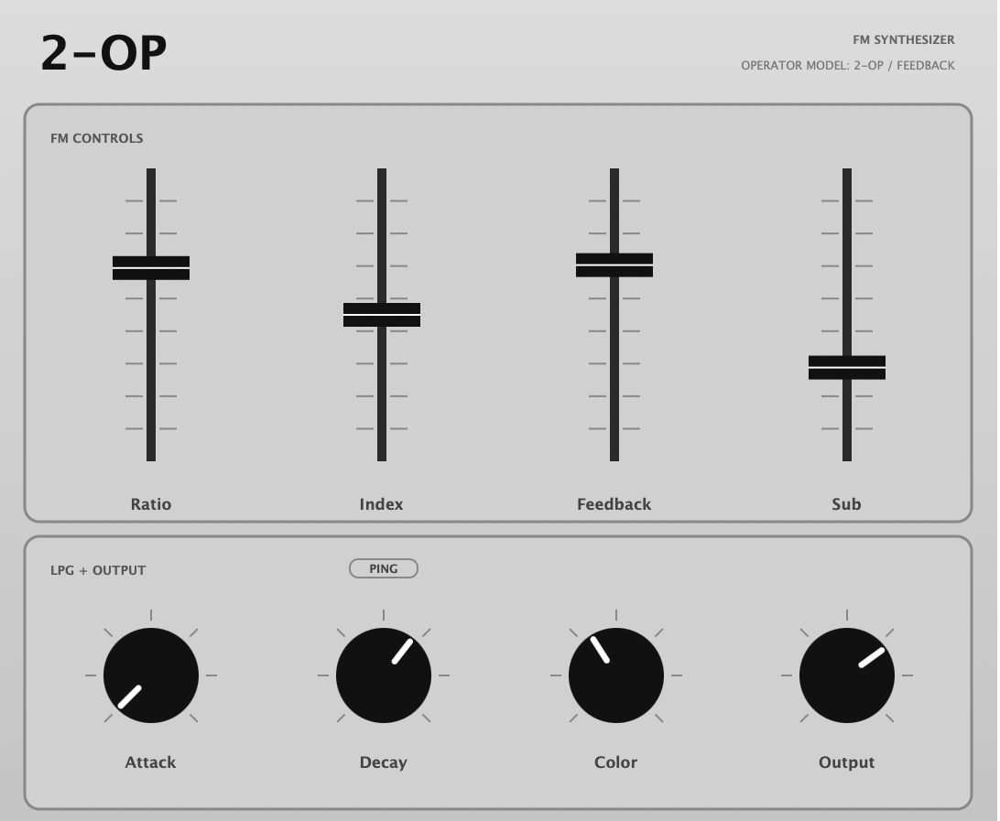
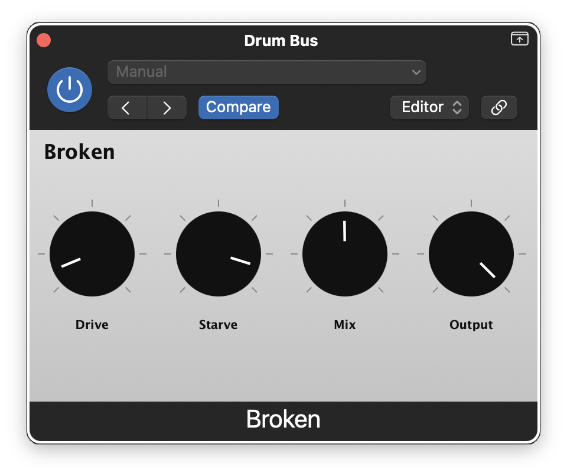
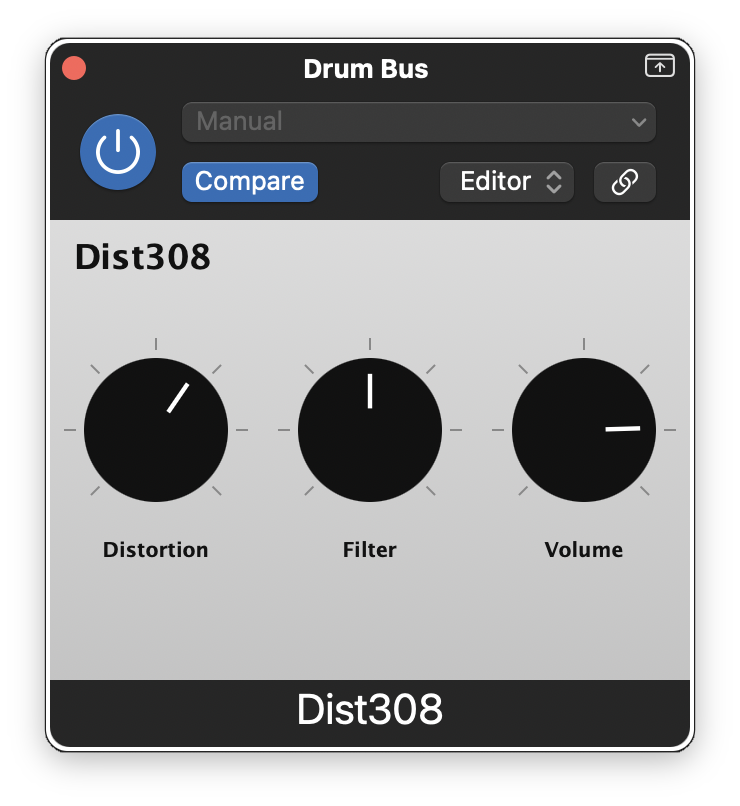
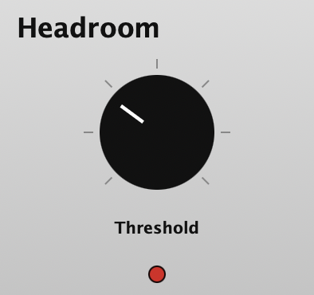
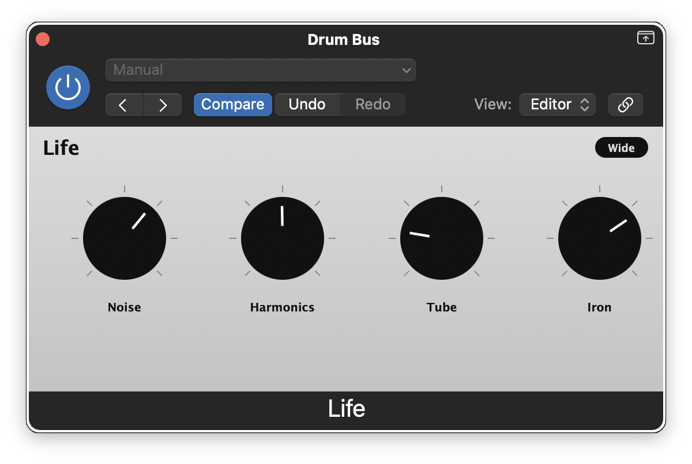
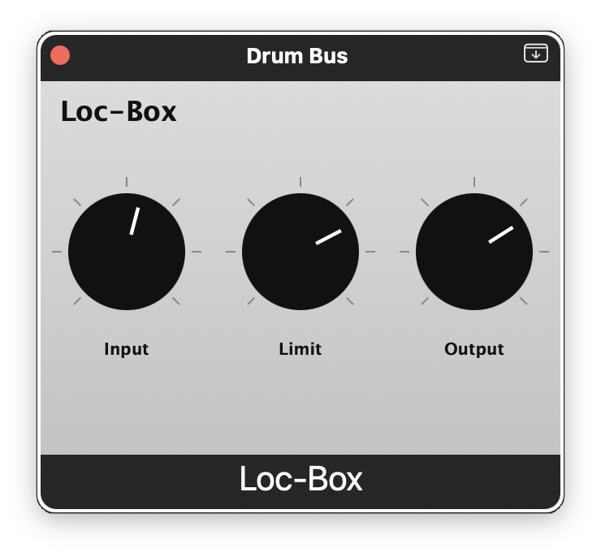

<h1>Corvid Audio</h1>

Audio plugins for music production. AU, VST3, and Standalone on macOS.

---

## Plugins

### 2-OP



A monophonic **2-operator FM synthesizer**. The DSP engine is the `FMEngine` from [Mutable Instruments Plaits](https://github.com/pichenettes/eurorack), adapted for standard sample rates. The amplitude/filter stage is a Plaits-style LPG (low-pass gate): a vactrol simulation feeding a combined SVF lowpass + VCA, giving the characteristic bloom and soft roll-off of a Buchla-style circuit.

| Parameter | Description |
|-----------|-------------|
| **Ratio** | Modulator-to-carrier frequency ratio |
| **Depth** | Modulation depth |
| **Feedback** | Operator self-feedback |
| **Sub** | Sub-octave carrier blend |
| **Attack** | LPG gate open time (Gate mode only) |
| **Decay** | Vactrol release time |
| **Color** | Lowpass filter / VCA tilt |
| **Output** | Output level (dB) |
| **PING** | Toggle between Gate (ADSR-like) and Ping (impulse transient) modes |

---

### Broken



A **circuit failure emulator**. Models the behavior of a transistor-based circuit operating outside its design envelope: as supply voltage drops, the transistor loses its stable operating point and begins oscillating between cutoff and saturation on every audio cycle. The result ranges from asymmetric clipping at full voltage down to sputtering, gated disintegration as the circuit collapses.

| Parameter | Description |
|-----------|-------------|
| **Drive** | Input gain into the circuit: audio taper, 1x to 10x |
| **Starve** | Supply voltage. 0 = nominal operation; as it rises the circuit loses its bias point and breaks apart |
| **Mix** | Dry/wet blend. 0 = clean input, 100 = fully processed |
| **Output** | Output level trim |

---

### Dist308



A **ProCo RAT-inspired distortion**. Models the key stages of the classic RAT circuit: a high-pass filter removes bass bloom before clipping, a pre-clip low-pass filter models the LM308 op-amp's gain-bandwidth product, `tanh` saturation emulates the diode clipping, and a post-clip tone filter provides the Filter control.

| Parameter | Description |
|-----------|-------------|
| **Distortion** | Drive amount: exponential gain curve with LM308 GBW rolloff |
| **Filter** | Tone control: CCW = dark (475 Hz), CW = bright (22 kHz) |
| **Volume** | Output level: quadratic taper |

---

### Headroom



A **hard clipper** with a single threshold control. Start at 100% for transparent passthrough, then pull back until the clip LED lights.

| Parameter | Description |
|-----------|-------------|
| **Threshold** | Clip ceiling: 100% = full scale, pull back to reduce headroom |
| **LED** | Lights red when the signal exceeds the threshold |

---

### Life



**Analog character and warmth** for digital tracks. Models the subtle imperfections of analog hardware: transformer coloration, console noise floor, harmonic distortion, and tube saturation, giving sterile digital mixes the depth and movement of real gear.

| Parameter | Description |
|-----------|-------------|
| **Noise** | Console noise floor: a real noise sample captured from an analog mixing console |
| **Harmonics** | Harmonic distortion: 70% 2nd harmonic (warm) and 30% 3rd harmonic (edge) |
| **Tube** | Tube-style `tanh` saturation, unity to 4x drive |
| **Iron** | SSL-style console transformer: gain staging, asymmetric saturation, DC blocking, HF rolloff |
| **Wide** | L/R decorrelation via per-channel random variation for a wider stereo image |

---

### Loc-Box



A **Shure Level Loc (M62/M62V) brickwall limiter** emulation. The Level Loc is a discrete transistor limiter from the late 1960s, originally designed for PA use, that became a cult favorite for its aggressive, pumping compression character. Models the input/output transformers, JFET gain element, sidechain AC coupling, and ~20:1 brickwall ratio.

| Parameter | Description |
|-----------|-------------|
| **Input** | Signal level into the limiter, up to +24 dB |
| **Limit** | Compression amount: 0 dBFS threshold at 0%, -24 dBFS at 100% |
| **Output** | Makeup gain, up to +24 dB |

---

## Building

### Requirements

- macOS 11.0+, arm64 or x86_64
- Xcode Command Line Tools (`xcode-select --install`)
- CMake >= 3.22 and Ninja (`brew install cmake ninja`)
- [JUCE](https://github.com/juce-framework/JUCE) source
- [eurorack](https://github.com/pichenettes/eurorack) source (required by 2-OP only)

### Build all plugins

```bash
cmake -B build -G Ninja \
    -DJUCE_DIR=/path/to/JUCE \
    -DEURORACK_DIR=/path/to/eurorack \
    -DCMAKE_OSX_ARCHITECTURES="arm64;x86_64" \
    -DCMAKE_OSX_DEPLOYMENT_TARGET=11.0 \
    -DCMAKE_BUILD_TYPE=Release \
    -DCMAKE_C_COMPILER=$(xcrun -f clang) \
    -DCMAKE_CXX_COMPILER=$(xcrun -f clang++)

cmake --build build --config Release
```

### Build a single plugin

```bash
cmake --build build --config Release --target <plugin>
```

| Plugin | `<plugin>` |
|--------|-----------|
| 2-OP | `TwoOpFM` |
| Broken | `Broken` |
| Dist308 | `Dist308` |
| Headroom | `Headroom` |
| Life | `Life` |
| Loc-Box | `LocBox` |

### Validate

```bash
auval -v <type> <code> CVDA
```

| Plugin | `<type>` | `<code>` |
|--------|---------|---------|
| 2-OP | `aumu` | `TWOP` |
| Broken | `aufx` | `BRKN` |
| Dist308 | `aufx` | `D308` |
| Headroom | `aufx` | `HDRM` |
| Life | `aufx` | `LIFE` |
| Loc-Box | `aufx` | `LBOX` |

## License

Copyright 2026 Corvid Audio

This project is licensed under the **GNU General Public License v3.0**.

Incorporates source code from [Mutable Instruments Eurorack](https://github.com/pichenettes/eurorack) (Emilie Gillet), also licensed under GPL-3.0. JUCE is used under its [GPL-3.0 open-source licence](https://github.com/juce-framework/JUCE/blob/master/LICENSE.md).
