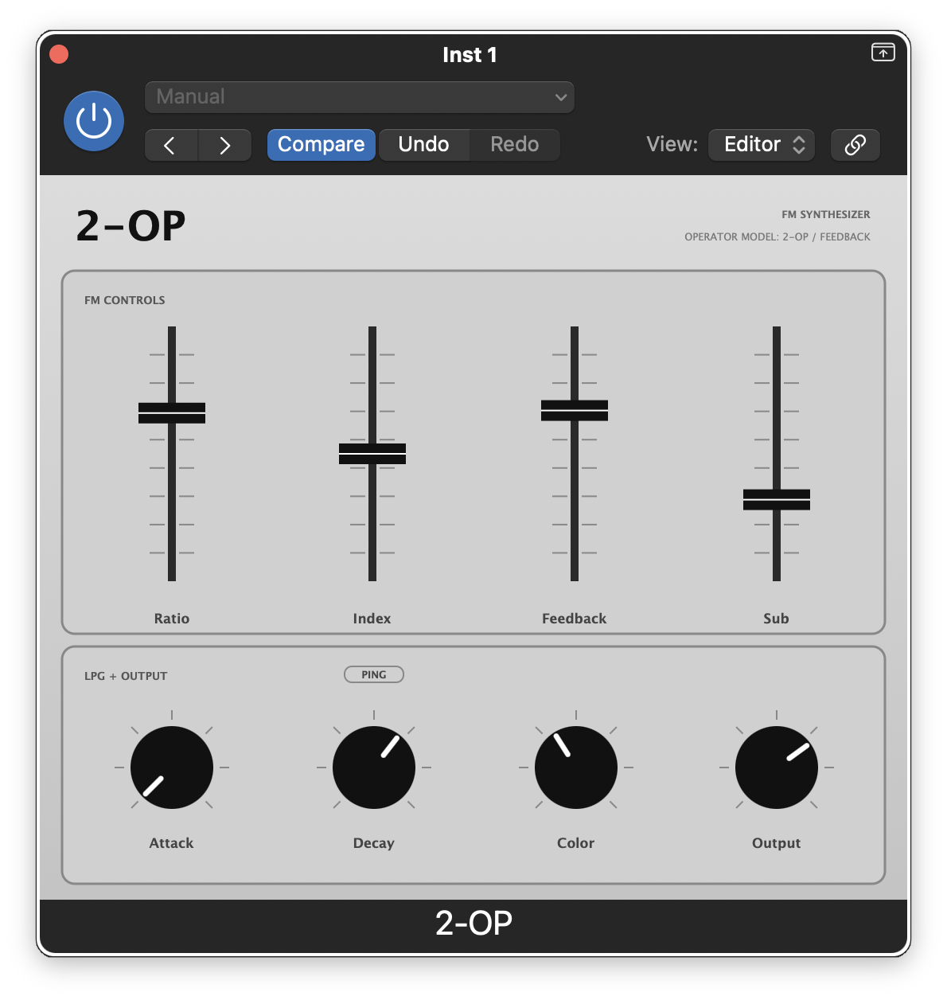

# 2-OP



A monophonic 2-operator FM synthesizer AU/VST3 plugin, built with [JUCE](https://juce.com).

The DSP engine is the `FMEngine` from [Mutable Instruments Plaits](https://github.com/pichenettes/eurorack), adapted for standard sample rates. The amplitude/filter stage is a Plaits-style LPG (low-pass gate): a vactrol simulation feeding a combined SVF lowpass filter + VCA, giving the characteristic bloom and soft roll-off of a Buchla-style circuit. MIDI is handled sample-accurately; pitch bend is +/-2 semitones; velocity scales both output amplitude and FM timbre.

## Parameters

**FM Controls** (sliders)

| Parameter | Description |
|-----------|-------------|
| Ratio | Modulator-to-carrier frequency ratio |
| Index | Modulation depth |
| Feedback | Operator self-feedback |
| Sub | Blend of sub-octave carrier output |

Hold Shift while dragging any slider for fine-tune resolution.

**LPG + Output** (knobs)

| Parameter | Description |
|-----------|-------------|
| Attack | LPG gate open time (only active in Gate mode) |
| Decay | Vactrol release time |
| Color | Tilt between lowpass filter and pure VCA (low = darker bloom, high = open VCA) |
| Output | Output level (dB) |

**PING toggle** — selects the LPG trigger mode:

- **Outlined (Gate)**: LPG follows the MIDI gate. Attack ramps to velocity on note-on; release decays on note-off.
- **Filled (Ping)**: Each note-on fires a single pitch-proportional impulse into the vactrol, which then decays freely. Holding a key has no effect — every note is a transient.

## Building

### Requirements

- macOS 11.0+, arm64 or x86_64
- Xcode Command Line Tools (`xcode-select --install`)
- CMake >= 3.22 and Ninja (`brew install cmake ninja`)
- [JUCE](https://github.com/juce-framework/JUCE) source
- [eurorack](https://github.com/pichenettes/eurorack) source (Mutable Instruments firmware)

### Setup

Clone this repo and the two dependencies as siblings:

```
parent/
  JUCE/
  eurorack/
  2-OP/
```

Or pass custom paths with `-DJUCE_DIR=... -DEURORACK_DIR=...`.

### Build

If JUCE and eurorack are siblings of the repo, just run:

```bash
cmake -B build -G Ninja \
    -DCMAKE_OSX_ARCHITECTURES="arm64;x86_64" \
    -DCMAKE_OSX_DEPLOYMENT_TARGET=11.0 \
    -DCMAKE_BUILD_TYPE=Release \
    -DCMAKE_C_COMPILER=$(xcrun -f clang) \
    -DCMAKE_CXX_COMPILER=$(xcrun -f clang++)
cmake --build build --config Release
```

If they're elsewhere, pass the paths explicitly:

```bash
cmake -B build -G Ninja \
    -DJUCE_DIR=/path/to/JUCE \
    -DEURORACK_DIR=/path/to/eurorack \
    -DCMAKE_OSX_ARCHITECTURES="arm64;x86_64" \
    -DCMAKE_OSX_DEPLOYMENT_TARGET=11.0 \
    -DCMAKE_BUILD_TYPE=Release \
    -DCMAKE_C_COMPILER=$(xcrun -f clang) \
    -DCMAKE_CXX_COMPILER=$(xcrun -f clang++)
cmake --build build --config Release
```

### Install

```bash
# AU
cp -R build/TwoOpFM_artefacts/Release/AU/2-OP.component \
      ~/Library/Audio/Plug-Ins/Components/
codesign --force --sign - ~/Library/Audio/Plug-Ins/Components/2-OP.component
auval -v aumu TWOP CVDA

# VST3
cp -R build/TwoOpFM_artefacts/Release/VST3/2-OP.vst3 \
      ~/Library/Audio/Plug-Ins/VST3/
codesign --force --sign - ~/Library/Audio/Plug-Ins/VST3/2-OP.vst3
```

### Package (sign, notarize, DMG)

The `scripts/package.sh` script builds, code-signs, creates a DMG, and notarizes it in one step. It requires an Apple Developer ID certificate and a notarytool keychain profile (see the script header for setup).

```bash
JUCE_DIR=/path/to/JUCE EURORACK_DIR=/path/to/eurorack ./scripts/package.sh
```

The env vars default to sibling directories (`../JUCE`, `../eurorack`) if not set.

## Formats

| Format | AU Type | Manufacturer | Plugin Code | Bundle ID |
|--------|---------|--------------|-------------|-----------|
| AU Instrument | `aumu` | `CVDA` | `TWOP` | `com.CorvidAudio.TwoOpFM` |
| VST3 | — | — | — | `com.CorvidAudio.TwoOpFM` |

## License

Copyright 2026 Corvid Audio

This project is licensed under the **GNU General Public License v3.0** — see [LICENSE](LICENSE) for the full text.

Incorporates source code from [Mutable Instruments Eurorack](https://github.com/pichenettes/eurorack) (Emilie Gillet), also licensed under GPL-3.0. JUCE is used under its [GPL-3.0 open-source licence](https://github.com/juce-framework/JUCE/blob/master/LICENSE.md).
